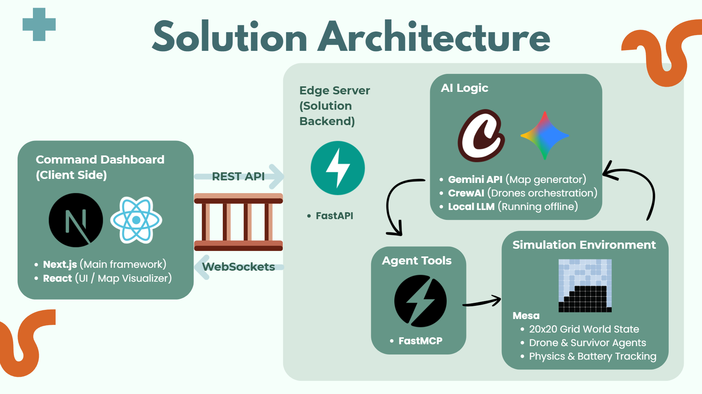

# SaveMePls: Decentralized Swarm Intelligent Drone Rescue 

**SaveMePls** is an autonomous, AI-orchestrated drone rescue system designed to maximize survival rates in post-disaster scenarios. By combining **Swarm Intelligence** with **Large Language Models (LLMs)**, we enable a fleet of drones to navigate complex environments, manage limited resources, and locate survivors with zero human intervention.

## 🏗️ System Architecturegit 


Our architecture bridges the gap between high-level reasoning and low-level execution:

*   **Orchestration (CrewAI)**: We utilize CrewAI to manage a centralized command hierarchy instead of individual agents. A **Swarm Dispatcher** handles high-level sector allocation, while a **Swarm Drone Operator** uses **Chain-of-Thought (CoT)** reasoning to process the entire fleet's state in a single batched pass. This dramatically reduces API overhead and prevents deadlocks. Powered by local LLMs or **Gemini 2.5 Pro** (You are encouraged to use local LLMs to simulate a blackout scenario).
*   **Simulation Environment (Mesa)**: Built on the Mesa framework, our environment provides a high-fidelity, agent-based simulation of disaster zones. It enforces real-world physics, obstacle constraints, and agent-environment interactions.
*   **Intelligence Layer (FastMCP)**: Using the **Model Context Protocol (MCP)**, we provide the agents with a standardized "toolbelt." These tools allow the LLM to query the simulation state, move drones, and identify survivors autonomously.
*   **World Generation (Gemini)**: We leverage Gemini to procedurally generate diverse disaster maps. By configuring obstacle density, building types, and survivor counts, we ensure our system is tested against a wide variety of "unseen" edge cases.
*   **Visualization (Next.js)**: A real-time web dashboard built with Next.js allows users to monitor the swarm's movement, battery levels, and search progress as the simulation unfolds. We used websocket to convey the from the Mesa in realtime to our dashboard

## 🚀 Methodology
*   **Priority-Based Partitioning**: Before deployment, we use a **Mathematical Greedy BFS** algorithm to divide the map. Every drone is assigned a search queue based on a **Cell Priority Score**, which factors in altitude and building type (e.g., prioritizing single-story homes over multi-story buildings during floods).
*   **High-Level Dispatching & Sub-Routing**: When drones sit IDLE, the **Dispatcher** retrieves real-time map context and assigns them a high-level sector to clear.
*   **Centralized Batch Execution**: Once the simulation begins, a single **Swarm Drone Operator** agent processes the raw state of *all drones simultaneously* per tick. It leverages MCP tools to output precisely synchronized movements as a batched payload, preventing simulation stalls and minimizing API requests.
*   **Dynamic Resource Allocation**: To ensure "zero wasted movement," the system dynamically reassigns search cells from busy drones to idle ones. Agents calculate the **movement cost** (considering battery life and obstacles) before committing to a new target.
*   **Transparent Reasoning**: Every action taken by the swarm is logged. Users can download and audit the **Agent’s Thought Process** and tool calls to understand **exactly why** a specific rescue decision was made.

## 🗺️ Future Improvements
Our vision for **SaveMePls** is to evolve from a 2D simulation into a comprehensive, multi-environment disaster response framework.

### 1. Multi-Disaster Adaptability
Currently optimized for flood scenarios, we aim to expand our agent’s reasoning to handle diverse disaster types, including:
*   **Wildfire**, **earthquake**, **landslide**, **snowslide**, etc.

### 2. High-Fidelity 3D Simulation
To bridge the gap between simulation and reality, we plan to migrate from a 2D grid to a **3D Voxel-based environment**.
*   **Verticality**: Allowing agents to optimize flight altitude for better a FOV (Field of View).
*   **Volumetric Obstacles**: Simulating complex urban canyons and overhanging debris.

### 3. Diverse Drone Specialization (Heterogeneous Swarms)
Moving beyond "Search-only" drones, we will introduce specialized roles:
*   **Relay Drones**: Acting as mobile mesh network nodes to ensure connectivity in "blackout" zones.
*   **Supply Drones**: Capable of delivering lightweight medical kits or life jackets to located survivors.

### 4. Advanced Dynamic Constraints
We will introduce more "Chaos Variables" to test agent resilience:
*   **Dynamic Weather**: Real-time rain and wind affecting battery drain and flight stability.
*   **Moving Obstacles**: Simulating flowing debris in water or collapsing structures.


## 🏃‍♂️ How to Run the Project

### 1. Configure the LLM Provider
You have two options to run the system: using the Gemini API or a Local LLM. We highly encourage using a Local LLM to demonstrate the system's capabilities to operate completely offline in a blackout scenario.

Create a `.env` file in the `rescue_swarm_sim` directory.

**Option A: Local LLM (Recommended for Blackout Scenarios)**
1. Install [Ollama](https://ollama.com/).
2. Pull a local model (e.g., Llama 3.1) by running: `ollama pull llama3.1`
3. Ensure Ollama is running, then add the following to your `.env` file:
```env
USE_LOCAL_LLM=true
LOCAL_MODEL="ollama/llama3.1"
OLLAMA_API_BASE="http://localhost:11434" 
```

**Option B: Gemini API**
```env
GEMINI_API_KEY="your_api_key_here"
```
### 2. Install Backend Dependencies
```bash
cd rescue_swarm_sim
python -m venv venv

# Activate the virtual environment (Windows):
venv\Scripts\activate  

# Activate the virtual environment (Mac/Linux):
# source venv/bin/activate

# Install requirements
pip install -r requirements.txt
```

### 3. Setup the Frontend Dashboard
```bash
# Open a new terminal or tab
cd rescue-ui
npm install
```

### 4. Launch the System
Run the master orchestrator script from the `rescue_swarm_sim` directory (ensure your Python virtual environment is active). This will simultaneously boot the FastAPI backend, initialize the SQLite database, and start the Next.js frontend.

```bash
cd rescue_swarm_sim
python main.py
```

Once the terminal confirms all systems are nominal, access the application at:
*   **Live Dashboard:** `http://localhost:3000`
*   **Backend API:** `http://localhost:8000`

*Note: To cleanly shut down all servers, press `Ctrl+C` in the terminal running `main.py`.*
