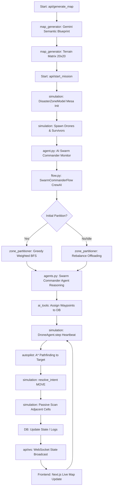

# SaveMePls: Swarm Deployment Implementation

This document outlines the technical architecture and deployment flow of the **SaveMePls** decentralized swarm intelligent drone rescue system.

## 🚀 Swarm Deployment Flow Diagram

## 🛠️ Key Components & Responsibilities

| Component | Class/Method | Responsibility |
| :--- | :--- | :--- |
| **Orchestrator** | `rescue_swarm_sim/main.py` | Launches Backend (FastAPI), Frontend (Next.js), and AI Agent (agent.py). |
| **AI Commander** | `agent.py` | Monitors DB for idle drones; triggers the CrewAI `SwarmCommanderFlow`. |
| **Mission Logic** | `flow.py` / `SwarmCommanderFlow` | Manages the mission lifecycle: State Loading -> Action Choice -> Partitioning -> Logging. |
| **Grid Partitioning**| `zone_partitioner.py` / `greedy_weighted_bfs` | Divides the map using weighted BFS; uses **Checkerboarding** (parity parity) for 50% flight efficiency. |
| **Simulation** | `simulation.py` / `DisasterZoneModel` | The physical Mesa world; manages agents, ticks, and mission status. |
| **Drone Agent** | `simulation.py` / `DroneAgent` | Individual agent logic; handles **Bingo Fuel** reflexes and waypoint following. |
| **Hardware Bridge**| `simulation.py` / `resolve_intent` | Validates physics (Manhattan Dist=1); executes moves and automatic **Step-and-Scan**. |
| **Pathfinding** | `autopilot.py` / `_a_star_path` | Calculates optimal paths around known obstacles using discovered map data. |
| **MCP Interface** | `mcp_server.py` | Exposes simulation controls (move, scan, status) as standardized Model Context Protocol tools. |

## 🧠 Core Intelligence Layer

### 1. Greedy Weighted BFS Partitioning
The system divides the 20x20 disaster zone among drones by considering terrain difficulty (weights) and distance from the drone's starting position.
- **Checkerboarding Optimization**: Drones only visit cells where `(x + y) % 2 == 0`. Since sensors scan all 4 adjacent cells upon arrival, this achieves 100% coverage with 50% flight time.

### 2. Physical Guardrails & Reflexes
- **Bingo Fuel**: Drones calculate the A* path back to base (9,9). If battery reaches `Distance + 5%`, they abort their current task and RTB immediately.
- **Step-and-Scan**: Every `MOVE` intent triggers an automatic scan of the 4 cardinal neighbors, updating the "Answer Plane" (Known Map) and detecting survivors without explicit scan commands.

### 3. CrewAI Orchestration
The `SwarmCommanderFlow` uses LLMs (Gemini 2.5 Flash) to narrate the strategic reasoning behind partitioning and rebalancing. This ensures the mission logs contain human-readable tactical explanations for the swarm's behavior.
